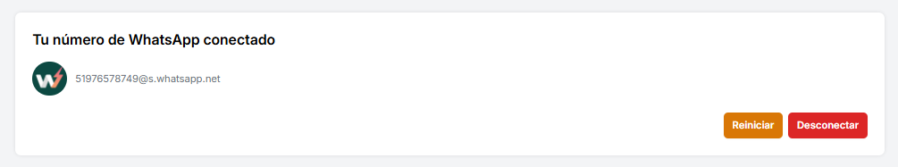

En esta sección dejaremos los pasos a seguir para poder conectarse y utilizar la API de WhatsApp

### Paso 1

Tener una cuenta en [https://app.wazend.net/register](https://app.wazend.net/register)

### &#x20;Paso 2

Dale clic al botón "Acceder" en tu instancia.

### Paso 3

Accederás tu panel de configuración y le darás clic botón "Mostar QR" el cual generará un QR con el que debe escanear desde tu WhatsApp, en la parte de Vincular dispositivos y después escaneas el QR

(Es similar a cuando vinculas WhatsApp Web)

.png)

### Paso 4

Si la conexión fue exitosa te aparecerá el mensaje "Tu número de WhatsApp conectado" como se ve en la fotografía de abajo.

